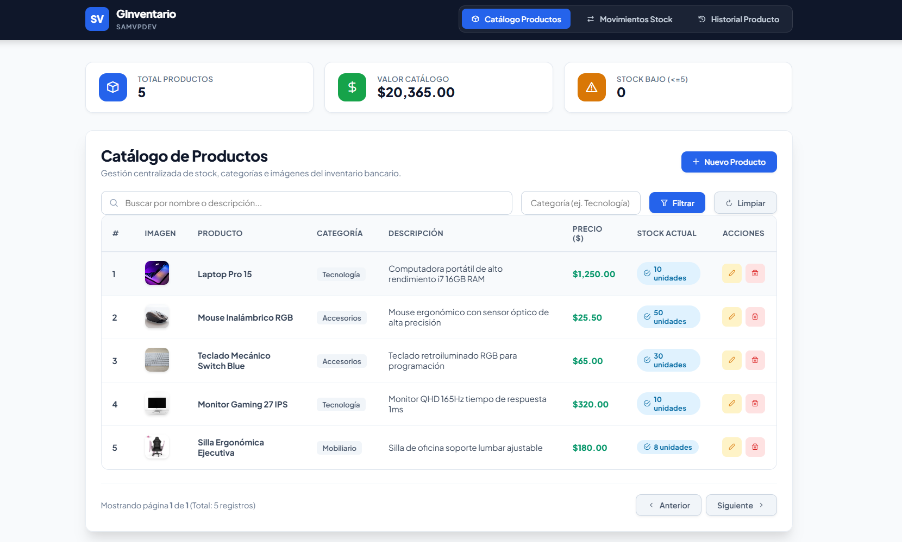
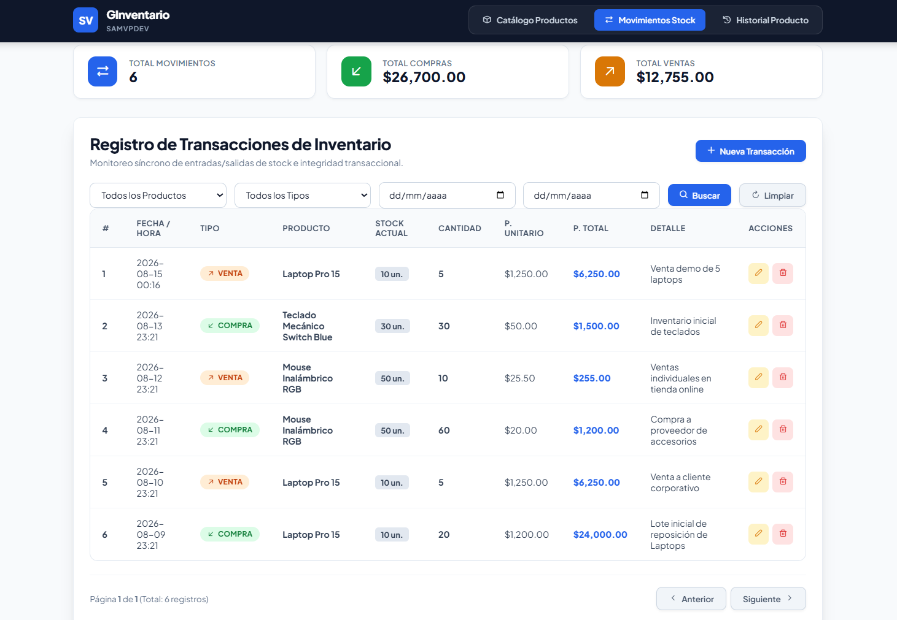
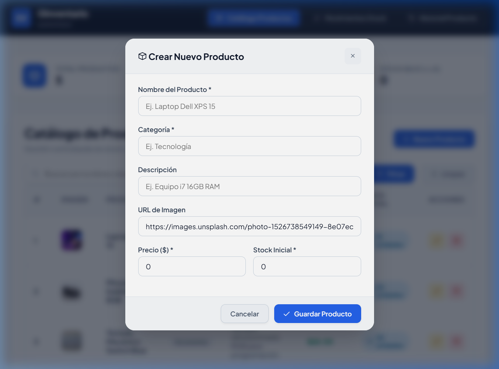
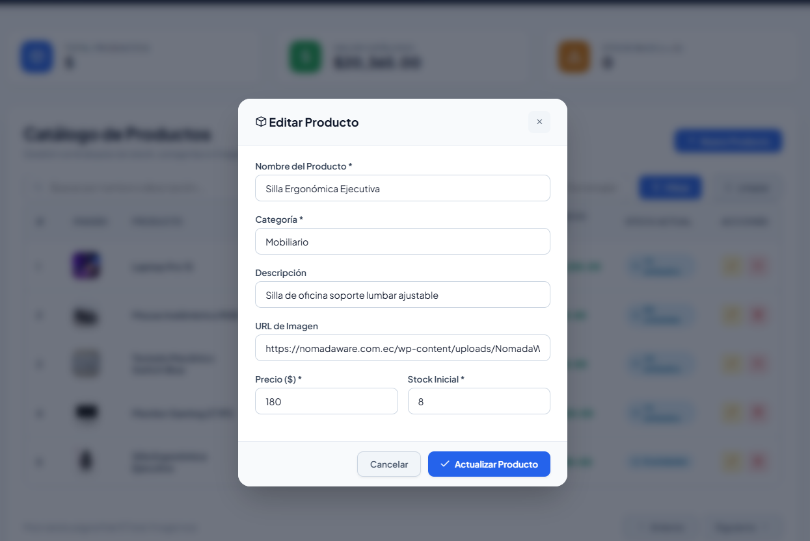
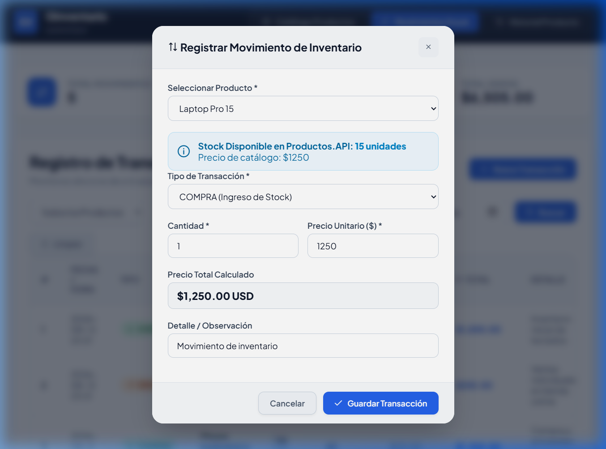
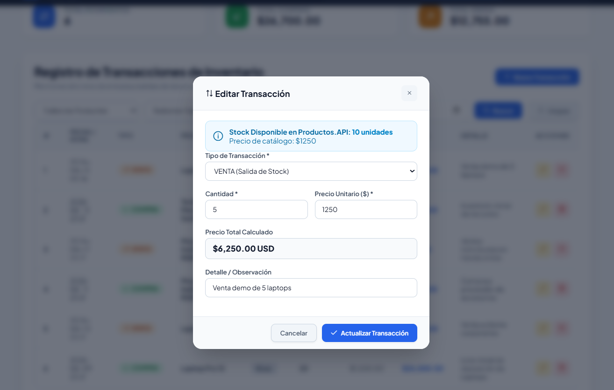
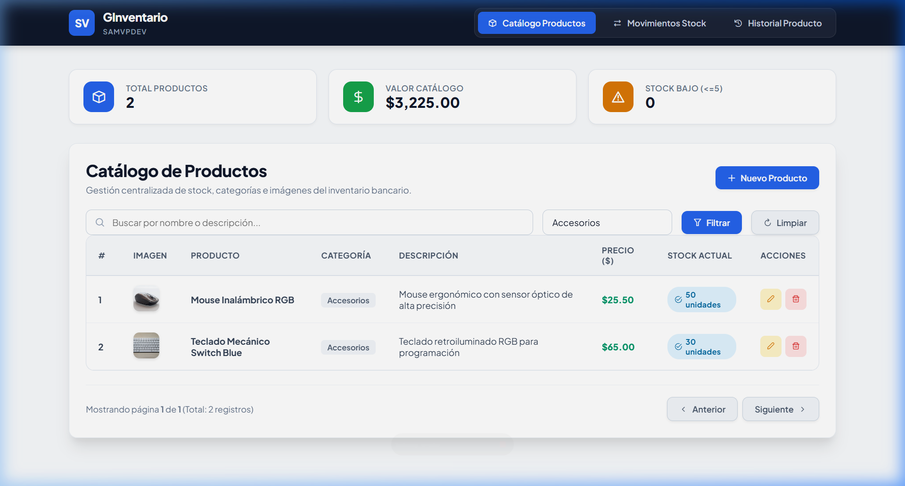
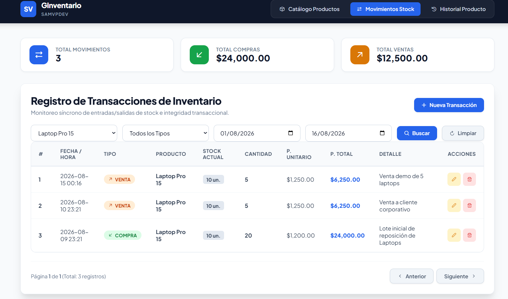
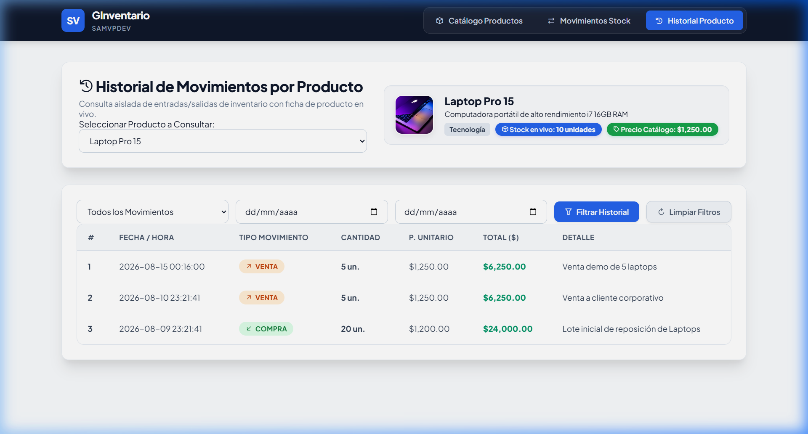

# GInventario - Sistema de Gestión de Inventarios y Transacciones (.NET & Angular)

Sistema web de gestión de inventarios y registro de movimientos de stock (compras y ventas) basado en una arquitectura de microservicios con **.NET 8 Core**, frontend en **Angular 18**, y base de datos relacional en **PostgreSQL**.

---

## Requisitos
Requisitos necesarios para poder ejecutar el proyecto en un entorno local:

### 1. Requisitos de Software
- **Docker Desktop** (v24.0+ con soporte para Docker Compose) - *Recomendado*.
- **.NET 8.0 SDK** (para ejecución manual del backend sin Docker).
- **Node.js** (v18.0.0+) y **npm** (v9.0.0+) (para ejecución manual del frontend sin Docker).
- **Angular CLI** (`npm install -g @angular/cli@18`).
- **PostgreSQL 16+** (si se utiliza una instancia local de base de datos fuera de Docker).

### 2. Variables de Entorno y Configuración
El proyecto incluye un archivo de plantilla **[`.env.example`](.env.example)** en la raíz con las credenciales predeterminadas de la base de datos y los puertos de servicio. Se puede crear el archivo `.env` mediante:
```bash
cp .env.example .env
```

---

## Ejecución Completa con Docker Compose (Recomendada)
Instrucciones para iniciar todo el ecosistema de la solución (Base de Datos PostgreSQL, Microservicio de Productos, Microservicio de Transacciones y Frontend Angular) en un solo paso:

```bash
docker compose up -d --build
```

### URLs de Acceso:
- **Frontend Angular:** [http://localhost:4200](http://localhost:4200)
- **Microservicio de Productos (Productos.API):** [http://localhost:5001](http://localhost:5001) *(Redirige a Swagger UI)*
- **Microservicio de Transacciones (Transacciones.API):** [http://localhost:5002](http://localhost:5002) *(Redirige a Swagger UI)*

---

## Ejecución del Backend (Sin Docker / Local)
Instrucciones y pasos necesarios para ejecutar los microservicios del backend en un entorno local manual:

1. **Inicializar la Base de Datos:**
   Ejecutar el script **[`init.sql`](init.sql)** en tu servidor PostgreSQL local para crear las tablas `Productos` y `Transacciones` con sus datos iniciales (*seed data*).

2. **Ejecutar Microservicio de Productos (`Productos.API`):**
   ```bash
   cd backend/src/Productos.API
   dotnet run
   ```
   *El servicio iniciará en HTTP en el puerto `5001`.*

3. **Ejecutar Microservicio de Transacciones (`Transacciones.API`):**
   ```bash
   cd backend/src/Transacciones.API
   dotnet run
   ```
   *El servicio iniciará en HTTP en el puerto `5002` y se comunicará síncronamente vía HTTP REST con `Productos.API`.*

---

## Ejecución del Frontend (Sin Docker / Local)
Instrucciones y pasos necesarios para ejecutar la aplicación frontend en un entorno local manual:

1. Navegar al directorio del frontend:
   ```bash
   cd frontend
   ```

2. Instalar las dependencias de Node:
   ```bash
   npm install --legacy-peer-deps
   ```

3. Iniciar el servidor de desarrollo de Angular:
   ```bash
   ng serve
   ```
   Abre tu navegador en [http://localhost:4200](http://localhost:4200).

---

## Evidencias
Capturas de pantalla que demuestran la funcionalidad del sistema:

### 1. Listado dinámico de productos y transacciones con paginación
- **Catálogo Dinámico de Productos:** Tabla con información paginada en servidor, stock en vivo e indicadores visuales.


- **Movimientos Dinámicos de Transacciones:** Listado paginado de compras y ventas con desglose de montos y stock en tiempo real.


### 2. Pantalla para la creación de productos
Formulario modal interactivo para registrar un nuevo producto con validaciones reactivas de campos vacíos y formatos.


### 3. Pantalla para la edición de productos
Formulario modal prellenado para actualizar la información existente de un producto (nombre, descripción, categoría, precio, stock).


### 4. Pantalla para la creación de transacciones
Formulario modal con selector de productos y **validación compleja de stock disponible** para evitar ventas sin inventario suficiente.


### 5. Pantalla para la edición de transacciones
Permite modificar los datos de una transacción registrada recalculando y reajustando automáticamente el stock en el backend.


### 6. Pantalla de filtros dinámicos
Búsqueda por término (nombre/descripción) y categoría en productos, además de filtro multinivel por producto, tipo de movimiento y rango de fechas en transacciones.



### 7. Pantalla para la consulta de información de un formulario (extra)
Vista especializada (`/historial`) que consulta la ficha técnica del producto seleccionado y su historial completo de movimientos auditados.


---
